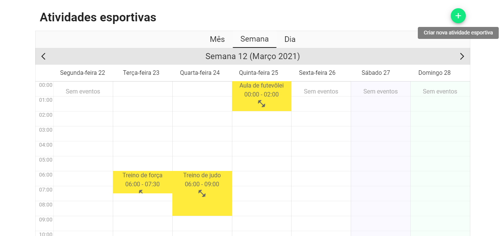

<h5 align="center">
  <b>Sport Activities</b> 🥋
</h5>
<p align="center">
  
</p>

## :eyes: Overview 
<div>
  
   
   
</div>

## :open_book: About
This project is a simple calendar for a sports establishment to add sports activities for customers to see in an organized way. <br />

## :rosette: API Routes
```
GET - sports/activity
POST - sports/activies
```

## :running_man: API - Installing and Running
 1. Clone this repository ```https://github.com/pferreirafabricio/sport-activities.git```;
 2. Enter in the project's folder: ```cd sport-activities```
 3. Enter in the API's folder: ```cd backend```
 4. Install dependencies: ```composer install```
 5. Run the migrations: ```php artisan migrate```
 6. Finally start the built-in PHP development server ```php -S localhost:8000 -t public``` 😃
 > __OBS:__ Remember to change the .env configurations <br/>
 
## 	:running_woman: Front End - Installing and Running
 1. Clone this repository ```https://github.com/pferreirafabricio/sport-activities.git```;
 2. Enter in the project's folder: ```cd sport-activities```
 3. Enter in the FrontEnd's folder: ```cd frontend```
 4. Install dependencies: ```npm install```
 5. Run the server: ```npm run serve```
 6. Access in your browser: ```http://localhost:8080``` 😃
 > __OBS:__ If your API is running in a different address than `http://locahost:8000`, change the baseUrl variable in `frontend/src/api/index.js`<br/>

## :bricks: This project was built with: 
- [PHP](https://www.php.net)
- [Lumen](https://lumen.laravel.com/)
- [MySQL](https://www.mysql.com)
- [Vue](https://vuejs.org/)
- [Vuetify](https://vuetifyjs.com/)

## :recycle: Contribute
 1. Fork this repository;
 2. Create a branch with your feature: ```git checkout -b my-feature```
 3. Commit your changes: ```git commit -m 'feat: My new feature'```
 4. Push your branch: ```git push origin my-feature```
 
## :page_with_curl:	License
This project is under the MIT license. Take a look at the [LICENSE](LICENSE.md) file for more details.
